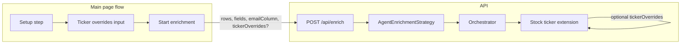

# Add optional ticker input from main page

## Goal

Allow users to optionally input ticker overrides (company or domain → ticker symbol) from the main page. When provided, the stock-ticker extension uses them for matching rows and skips external API calls. **Core enrichment (orchestrator, agents, CSV flow) is not modified.**

## Architecture (unchanged vs new)

- **Unchanged:** [app/api/enrich/route.ts](app/api/enrich/route.ts) row loop and strategy usage; [lib/agent-architecture/orchestrator.ts](lib/agent-architecture/orchestrator.ts); all agents; [lib/strategies/agent-enrichment-strategy.ts](lib/strategies/agent-enrichment-strategy.ts) call to `orchestrator.enrichRow()`.
- **Extended (additive only):**
  - Types: optional `tickerOverrides` on the request.
  - API: read optional `tickerOverrides`, pass into strategy.
  - Strategy: pass optional overrides into the stock-ticker extension only (after orchestrator returns).
  - Extension: if override exists for current row’s company/domain, return it and skip resolver; otherwise keep current behavior.

## Implementation steps

### 1. Types

- In [lib/types/index.ts](lib/types/index.ts), add to `EnrichmentRequest`:
  - `tickerOverrides?: Record<string, string>`  
  - Key = company name or domain (e.g. `"Apple Inc"` or `"apple.com"`), value = ticker (e.g. `"AAPL"`). Lookup will be normalized (e.g. lowercase, trim) so casing does not matter.

### 2. API route

- In [app/api/enrich/route.ts](app/api/enrich/route.ts):
  - Destructure `tickerOverrides` from `body` (optional).
  - Pass `tickerOverrides` into each `enrichmentStrategy.enrichRow(...)` call. This requires adding an optional last parameter (e.g. `options?: { tickerOverrides?: Record<string, string> }`) to the strategy’s `enrichRow` so the API can call: `enrichRow(row, fields, emailColumn, onProgress, onAgentProgress, { tickerOverrides })`.

### 3. Strategy

- In [lib/strategies/agent-enrichment-strategy.ts](lib/strategies/agent-enrichment-strategy.ts):
  - Extend `enrichRow` with an optional sixth parameter: `options?: { tickerOverrides?: Record<string, string> }`.
  - After `orchestrator.enrichRow()` returns, when calling `enrichStockTickerFields`, pass the optional `tickerOverrides` (from `options`) into the extension. No other logic changes; if `options` or `tickerOverrides` is missing, behavior stays as today.

### 4. Stock-ticker extension

- In [lib/extensions/stock-ticker/index.ts](lib/extensions/stock-ticker/index.ts):
  - Add optional parameter: `tickerOverrides?: Record<string, string>` to `enrichStockTickerFields`.
  - Before calling `resolveStockTicker`, derive `companyName` and `domain` as today, then check for an override using a normalized key (e.g. `companyName?.toLowerCase().trim()` or `domain?.toLowerCase().trim()`). If a key exists in `tickerOverrides`, use that ticker and return the same enrichment shape (with a simple `EnrichmentResult`) without calling the resolver. If no override matches, call `resolveStockTicker` as today. Validate overridden value with the same ticker format (e.g. 1–5 uppercase letters) if desired.

### 5. UI – setup step (main page)

- **Where:** Show the ticker input on the **setup** step (where user selects email column and fields), so it is contextual and only relevant when “Stock Ticker” can be selected.
- **Placement:** In [app/fire-enrich/unified-enrichment-view.tsx](app/fire-enrich/unified-enrichment-view.tsx), add an optional section (e.g. collapsible or always-visible) “Ticker overrides (optional)” when the user has selected the Stock Ticker field. Allow adding pairs: “Company or domain” → “Ticker” (e.g. “Apple Inc” / “apple.com” → “AAPL”). Store in state as `Record<string, string>` (or array of `{ key, ticker }` then normalize to record).
- **Callback:** Extend `onStartEnrichment` to include the optional overrides: e.g. `onStartEnrichment(emailColumn, fields, tickerOverrides?)`. Update the component’s prop type and the single call site that starts enrichment.

### 6. Page state and EnrichmentTable

- In [app/page.tsx](app/page.tsx):
  - Add state: `tickerOverrides: Record<string, string> | undefined`.
  - Update `handleStartEnrichment` to accept an optional third argument `tickerOverrides` and set state.
  - Pass `tickerOverrides` into `EnrichmentTable` as an optional prop.
- In [app/fire-enrich/enrichment-table.tsx](app/fire-enrich/enrichment-table.tsx):
  - Add optional prop `tickerOverrides?: Record<string, string>` to the component and to the interface.
  - In the `fetch("/api/enrich", ...)` body, include `tickerOverrides` when defined (do not send when undefined or empty so the API stays backward compatible).

## Safety and backward compatibility

- **Core:** Orchestrator and agents are not called with ticker data; only the existing extension hook in the strategy is extended with an optional argument.
- **API:** If `tickerOverrides` is omitted or empty, the API and strategy behave exactly as today.
- **Extension:** Overrides are used only when a key matches the current row’s company/domain; otherwise the existing resolver runs. No change to resolver’s Firecrawl/OpenAI usage when no override is present.
- **UI:** Feature is optional; users can leave overrides empty and use only CSV + field selection as today.

## Files to touch (minimal)

| Area      | File                                          | Change                                                                |
| --------- | --------------------------------------------- | --------------------------------------------------------------------- |
| Types     | `lib/types/index.ts`                          | Add `tickerOverrides?` to `EnrichmentRequest`                         |
| API       | `app/api/enrich/route.ts`                     | Read `tickerOverrides`, pass to `enrichRow(..., { tickerOverrides })` |
| Strategy  | `lib/strategies/agent-enrichment-strategy.ts` | Add optional 6th param, pass to `enrichStockTickerFields`             |
| Extension | `lib/extensions/stock-ticker/index.ts`        | Add optional `tickerOverrides`, use before calling resolver           |
| Setup UI  | `app/fire-enrich/unified-enrichment-view.tsx` | Ticker overrides section + extend `onStartEnrichment`                 |
| Page      | `app/page.tsx`                                | State + `handleStartEnrichment` + pass to `EnrichmentTable`           |
| Table     | `app/fire-enrich/enrichment-table.tsx`        | Prop `tickerOverrides`, include in POST body                          |

No new env vars, no changes to orchestrator or agents, and no change to the existing stock-ticker resolver signature beyond the extension’s internal use of overrides.